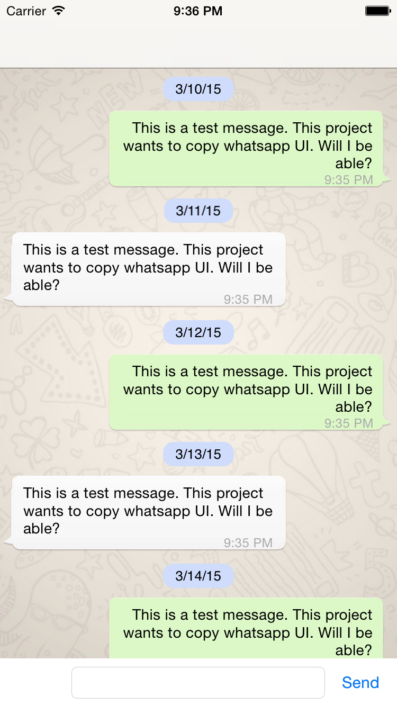

# whatsapp-ios
A simple message UI library similar to WhatsApp app

I need to implement a chat UI for iOS, so because I use whatsapp a lot a rarely iOS App
I decide create something similar to it. So I started search a lot about similar Whatsapp UI. 
on google and I found some works similar to iOS Message app. A relly good one can be found here:

https://github.com/jessesquires/JSQMessagesViewController

But no results to projects similar to whatsapp. So I decided create it.

I'm developing yet, but if you guys download it and run, you will see that it already 
have something concrete. Anyone who want to help is welcome. This project is really simple.

For now, I just support send text.

Contributors are welcome!

For Android, visit my friend project: https://github.com/DeromirNeves/whatsapp-android

